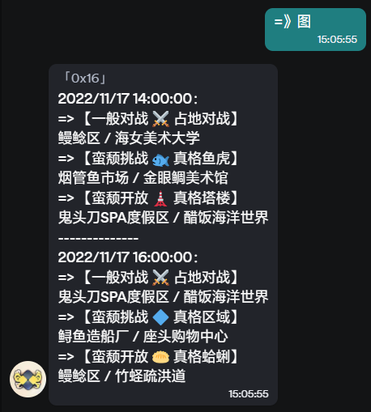
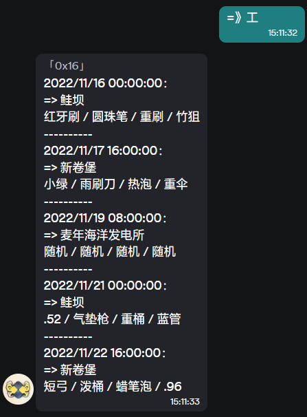
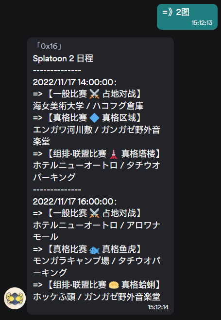
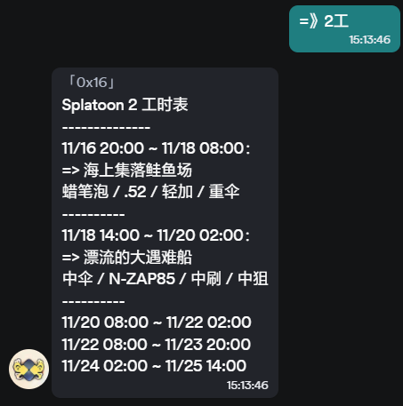
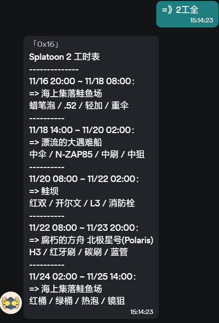
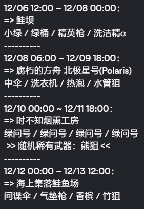

# simple-splat-onebot

A simple splatoon bot for OneBot.

超简单的用于 OneBot 协议（如QQ） 的 Splatoon 机器人。

## 简介

本项目是一个基于 OneBot 协议的 Splatoon2 / Splatoon3 的日程查询机器人。会根据指令返回对应文字版日程。

基于 [splatoon2.ink](https://splatoon2.ink) , [splatoon3.ink](https://splatoon3.ink) 以及 [Oatmealdome](https://splatoon.oatmealdome.me/) 的 API。

~~茶茶用node.js的随便写的，就一个index.js也好意思拿的出手吗你~~
~~但是能用~~

默认前缀（6选1）：=> =》 -) -） =） =)

指令：=>图



指令：=>工

  

指令：=>2图

  

指令：=>2工

  

指令：=>2工全



2代打工地图全量输出中，含有随机武器时的具体可能随机到的熊武器。示例：

  

## 详细使用方法

### 1. 下载或安装任意 OneBot 实现

[OneBot](github.com/howmanybots/onebot) 是一个开放的协议，任何实现了 OneBot 协议的机器人都可以使用本项目。

这里推荐使用 [go-cqhttp](github.com/Mrs4s/go-cqhttp) 登录QQ。

### 2. 下载本项目

使用 git Bash

```bash
git clone https://github.com/teatube/simple-splat-OneBot.git
```

[git下载](https://git-scm.com/downloads)

### 3. 安装依赖

```bash
npm install
# 或
yarn
```

npm 指令需要安装 [Node.js](https://nodejs.org/zh-cn/) 才可以使用.

国内网络可以考虑 [cnpm](https://github.com/cnpm/cnpm) 以及 [tyarn](https://github.com/yiminghe/tyarn) 使用淘宝镜像加速.

### 4. 修改配置文件，启用 ws 正向协议

```bash
# 示例：go-cqhttp
# 修改 go-cqhttp 的配置文件，增加 ws 正向协议
servers:
# 如果有可以直接更改，没有请自行添加
  - ws:
      # 正向WS服务器监听地址
      address: 127.0.0.1:6700
      middlewares:
        <<: *default # 引用默认中间件

```

### 5. 修改config.yml当中的服务器地址，使其和你的机器人的ws地址匹配

```yaml
# WebSocket 服务器地址
wsServer: ws://127.0.0.1:6700
```

### 6. 启动

```bash
npm start
# 或
yarn start
```
